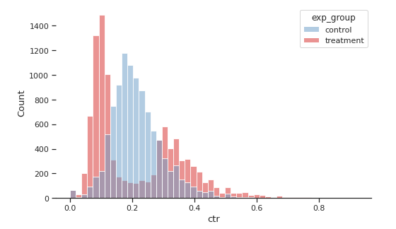
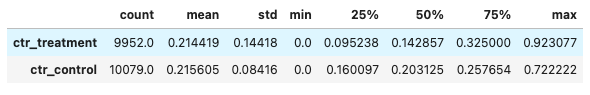
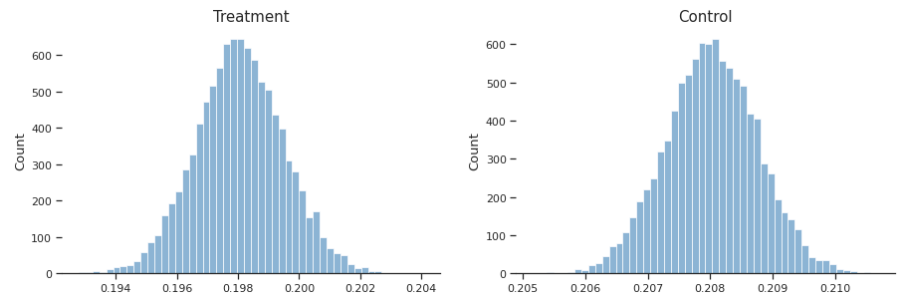
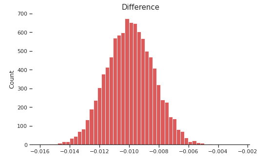
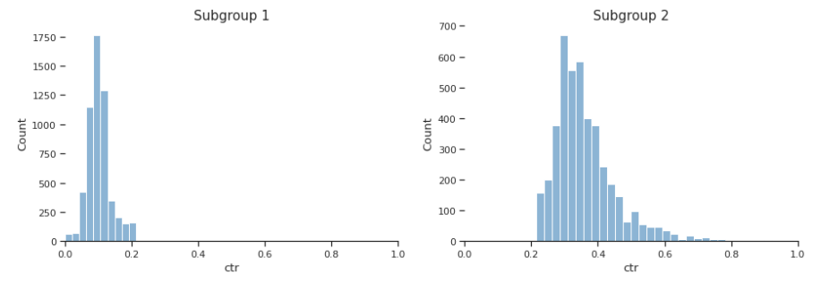

## Анализ результатов A/B теста

**Стек:** Python, Pands, Numpy, Scipy, Seaborn

#### Начальные условия

Имеются две выборки пользователей: экспериментальная (**treatment**) и контрольная (**control**).
В группе **treatment** был использован один из новых алгоритмов рекомендации постов, группа **control** использовалась в качестве контроля.  
Основная гипотеза заключается в том, что новый алгоритм приведет к увеличению CTR в **treatment** группе.

После проведения эксперимента получены следующие распределения CTR для контрольной и экспериментальной групп.

Среднее значение CTR в экспериментальной группе ниже примерно на 0,001.

#### Выбор метода для A/B теста
Формы распределений экспериментальной и контрольной групп заметно отличаются, поэтому t-test сработает неэффективно. Для AB-теста будет использоваться пуассоновский бутстреп (размер групп более 100 элементов позволяет выбрать этот метод), реализованный с помощью библиотеки Scipy. 

#### Результаты A/B теста

#### Рекомендации

По результатам тестирования с помощью пуассоновского бутстрепа нулевая гипотеза отклоняется - выборки различаются статистически значимо. Контрольная группа в среднем демонстрирует лучшие результаты по CTR. Различия в средних распределяются вокруг 0,01 в форме, схожей с формой нормального распределения, и не пересекают ноль. Если опираться только на результаты теста, то следует отказаться от нового алгоритма.

Так как форма распределения экспериментальной выборки двухмодальна, можно предположить о влиянии третьей переменной (переменных) на CTR в экспериментальной группе.

Разделим экспериментальную группу пользователей на две подгруппы:
- subgroup1 - те, у которых CTR меньше или равен среднему 
- subgroup2 - те, у которых CTR больше среднего.  

Размер первой подгруппы - 5620, средний CTR равен примерно 0.102, что на 63% ниже, чем у контрольной группы.  
Размер второй подгруппы - 4332, средний CTR равен примерно 0.360, что на 67% выше, чем у контрольной группы.  

Это означает, что в зависимости от значения условной третьей переменной с помощью нового алгоритма мы можем либо уменьшить глобальный CTR на 63%, либо увеличить на 67%, что является очень большим приростом. 

В конечном итоге ориентироваться только на результаты тестов было бы неправильно. Необходимо продолжить работу в данном направлении и использовать полученные данные для поиска третьего фактора (факторов), под влиянием которого в экспериментальной группе образовалось две моды. В дальнейшем при необходимости повторить AB-тест, изменив структуру экспериментальной и контрольной группы в зависимости от обнаруженного фактора.